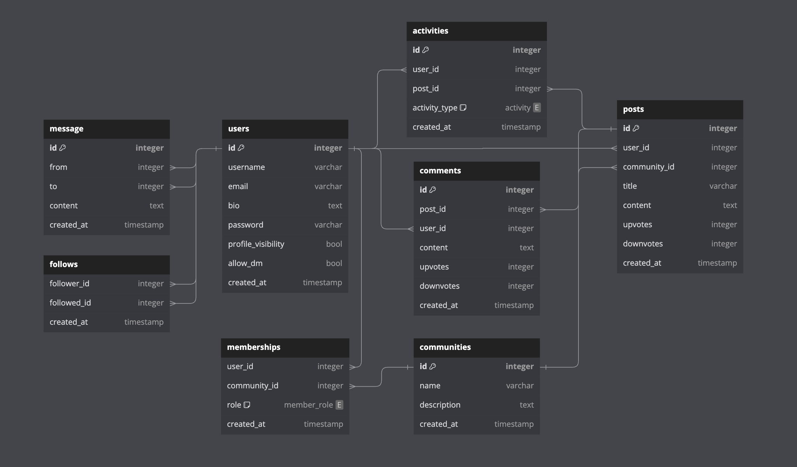
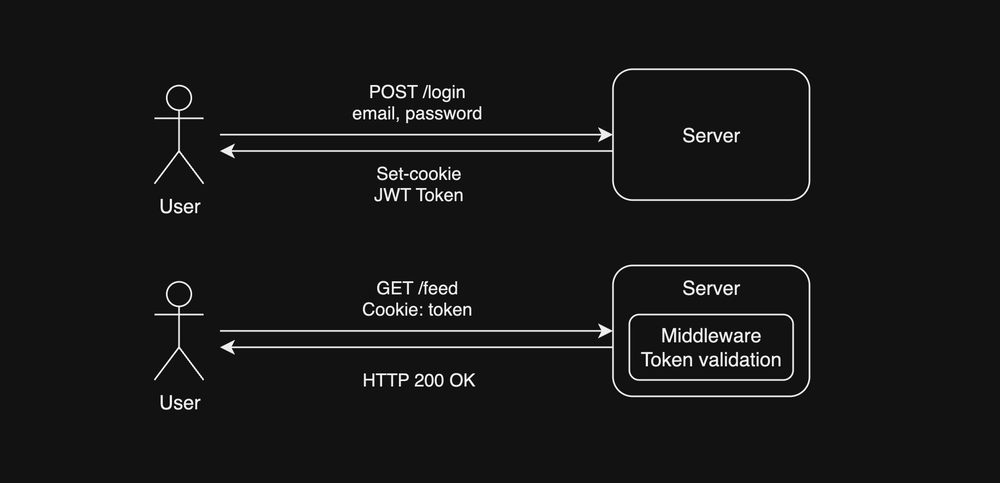
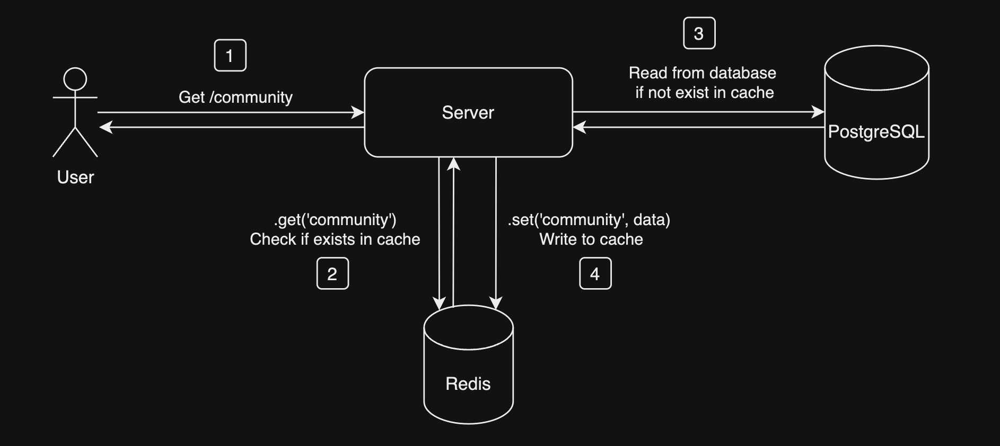
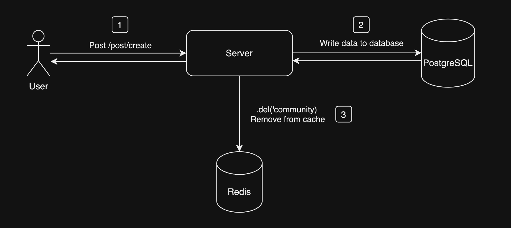

# SOCIAL MEDIA APP - BACKEND

> **This is my hobby project, I created this project with the primary goal of enhancing my backend development skills. By building this social media application using Node.js, I aimed to deepen my understanding of server-side programming. It offers a platform for users to connect, share their thoughts, and interact with a diverse community of people.**

## 🛠️ Technologies

- ✅ Node.js
- ✅ Typescript
- ✅ Express
- ✅ Prisma ORM
- ✅ PostgreSQL
- ✅ Docker
- ✅ Jest
- ✅ Redis
- ✅ JWT
- ✅ Morgan
- ✅ Yup
- ✅ Eslint
- ✅ Prettier
- ✅ Nodemon
- ✅ Helmet

## ⚡️ Features

> 🏁 Authentication (Register/Login)

> 🏁 User profile visibility option

> 🏁 Create new community

> 🏁 Join/leave community

> 🏁 Role based authorization in communities (Founder, moderator, member)

> 🏁 Create and share post

> 🏁 Delete shared post

> 🏁 Create/delete comments on posts

> 🏁 Upvote/downvote posts

> 🏁 Follow/unfollow users

## Folder Structure

    .
    ├── config
    ├── controllers
    ├── interfaces
    ├── middlewares
    ├── routes
    ├── schemas
    ├── services
    ├── types
    └── utils

## Database Diagram

## Authentication

## Cache Strategy

